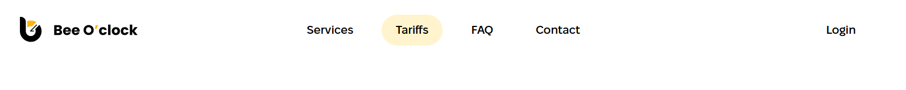
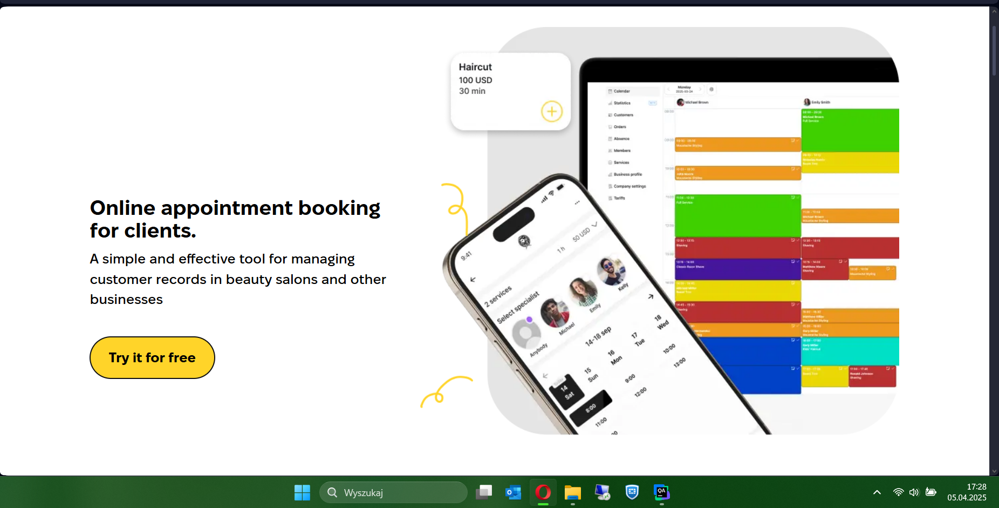
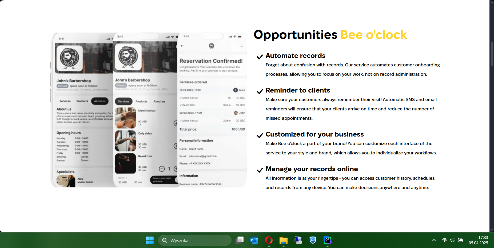
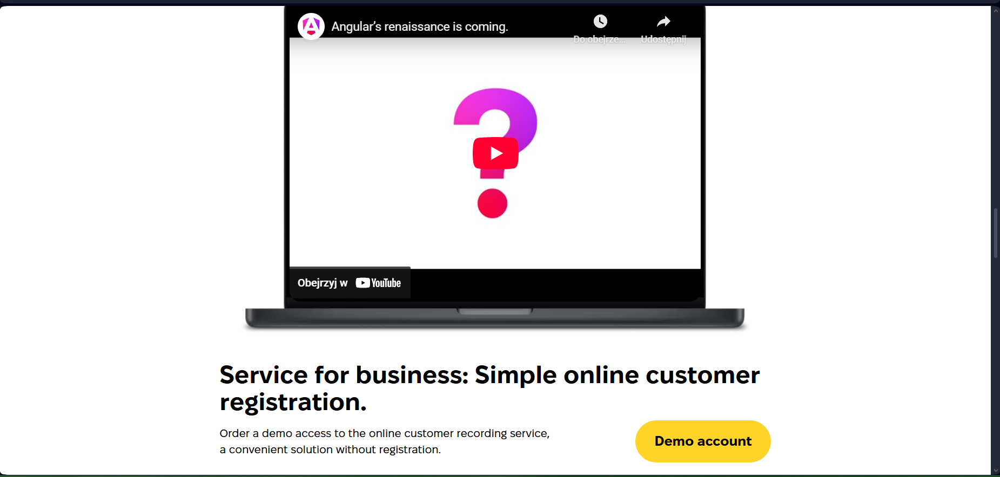
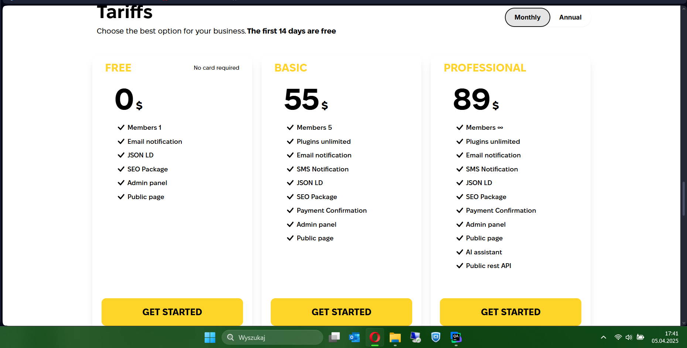
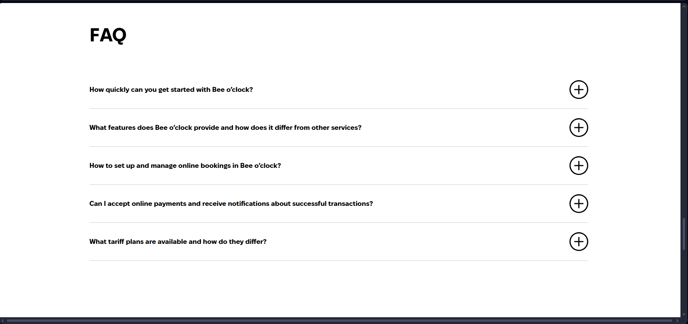
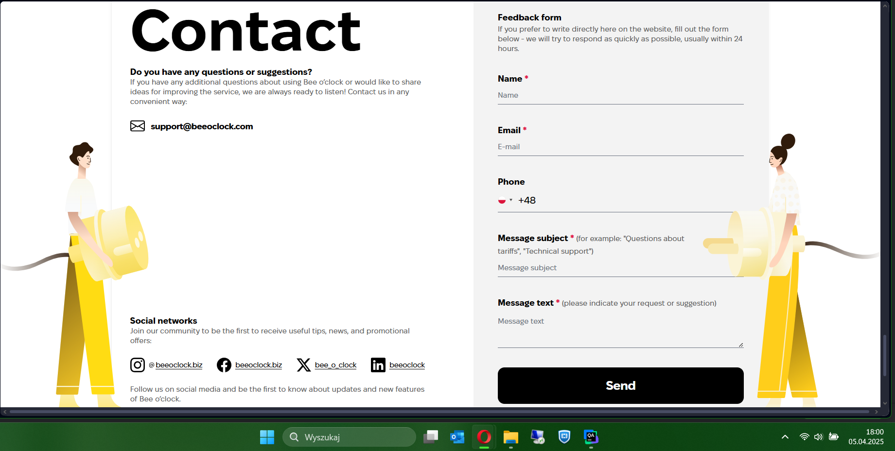
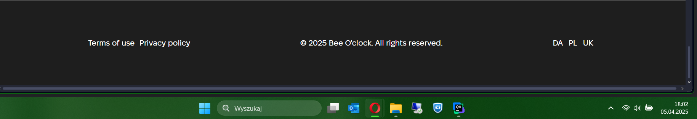

## 📌 Description

Please provide a short summary explaining what this PR does.

---

## ✅ General Checklist

- [ ] Code has been tested locally
- [ ] No `console.log` or `debugger` left in code
- [ ] Documentation/README updated if necessary
- [ ] consult with QA team 
- [ ] run e2e tests by action from https://github.com/beeoclock/client-app-e2e/actions/workflows/clientAppTest.yml

  
Manual Test Checklist - `main` branch

### **1. visiting the app**
- [ ] visit https://biz.dev.beeoclock.com and check that the app is opened in english version
- [ ] visit https://biz.dev.beeoclock.com/pl and check that the app is opened in polish version

### **2. assert of header**
- [ ] check that the logo is visible 
- [ ] assert that button Services, Tariffs, FAQ, Login Contact present yellow hoover color after is triggered
- 
- [ ] click on the Login page, and assert that in new card is opened the login page
- [ ] click on the Contact page, and assert that page has been scroll into the contact section
- [ ] click on the Services page, and assert that page has been scroll into the services section
- [ ] click on the Tariffs page, and assert that page has been scroll into the tariffs section
- [ ] click on the FAQ page, and assert that page has been scroll into the FAQ section

### **2. appointment section**
- [ ] check that the image is visible and correctly presented
- 
- [ ] assert that button "try it for free" is visible and after click is new tab opened with the link https://crm.dev.beeoclock.com/identity/sign-up

### **3. Opportunities section**
- [ ] check that the image is visible and correctly presented
- 

### **4. Services section**
- [ ] check that the image is visible and correctly presented
- [img_4.png](img_4.png)

### **5. move section**
- [ ] check that the image is visible and correctly presented

- assert that mp4 video is visible and correctly presented <link>link</link>

### **6. tariffs section**
- [ ] check that the image is visible and correctly presented
- 
- [ ] assert that switch annual and monthly is visible and clickable 
- [ ] verify that get started button is visible and clickable, after click is opened the link https://crm.dev.beeoclock.com/identity/sign-up
- [ ] ensure that tariff prices are correctly presented

### **7. FAQ section**
- [ ] check that the image is visible and correctly presented

- [ ] assert that question: "How quickly can you get started with Bee o’clock?" have answer:
    - [ ] Starting to use the service is very simple: register on the platform, add basic information about your business and services, and the system will be ready to go. You have the option to use the free plan (Free) with basic functionality, which will allow you to immediately test the key features of Bee o’clock without any costs.

- [ ] assert that question: "What features does Bee o’clock provide and how does it differ from other services?" have answer:
    - [ ] Bee o’clock offers a comprehensive set tools for automating online bookings
      Automation of bookings: the system automatically records new bookings and reserves time in the calendar.
      Reminders to clients: SMS and e-mail notifications will help reduce the number of missed appointments.
      Customization for your brand: you can change the appearance of your public page and customize the interface to suit your business.
      Online booking management: the entire schedule is always at hand and can be accessed from a smartphone or computer.
      Analytics and development: the service tracks statistics so you can improve customer interactions.
      Various pricing plans: from free to advanced PRO, with the ability to connect an AI assistant and public REST API.

- [ ] assert that question: "How to set up and manage online bookings in Bee o’clock?" have answer:
    - [ ] Everything happens in a few simple steps
      Register on the platform: create an account and enter your business details.
      Service settings: add a list of services, set the duration and price.
      Invite customers: share a unique link to your profile via your website, social media, or email.
      Online customer booking: customers can book a service in a few clicks, and you will receive notifications about each new booking.
      Manage your recordings: Conveniently change your schedule, track activity, and get notified about changes.
      Analysis and development: View statistics to evaluate performance and improve your service.

- [ ] assert that question: "Can I accept online payments and receive notifications about successful transactions?" have answer:
    - [ ] Yes, the BASIC and PRO plans have a Payment Confirmation feature that allows you to track customer payments. The service also sends SMS and email notifications so that you and your customers are always up to date with booking and payment updates. All this ensures safe and transparent transactions.

- [ ] assert that question: "What tariff plans are available and how do they differ?" have answer:
    - [ ] Free (0 USD): 1 user, public page, admin panel, SEO Package, JSON LD, e-mail notifications. Suitable for small projects or testing.
    - [ ] Basic (55 USD): 5 users, public page, admin panel, SEO Package, JSON LD, email notifications, unlimited plugins, Payment Confirmation and SMS Notifications. Solution for small and medium businesses.
    - [ ] Pro (89 USD): unlimited users, full access to features, including AI assistant and Public REST API. Ideal for advanced and scalable projects.

### **8. Contact section**
- [ ] check that the image is visible and correctly presented

- [ ] assert that the form is visible and correctly presented
- [ ] assert that the form have 4 fields: Name, Email, Phone, Message
- [ ] assert that the form have button "Send message" and after click the email is sended (devtools)
- [ ] assert that social networks links are visible and clickable (Instagram, Facebook, X, LinkedIn)

### **9. Footer section**
- [ ] check that the image is visible and correctly presented

- [ ] assert that terms of use link is visible and clickable, after click is opened the link https://docs.beeoclock.com in the new card
- [ ] assert that privacy policy link is visible and clickable, after click is opened the link https://docs.beeoclock.com/privacy-policy in the new card

### **10. languages**
- [ ] select all available languages (English, Polish, Ukrainian, Danish) and check that the app is opened in the selected language

---

  
🚨 Additional checklist for PRs targeting <code>main</code> branch

> ⚠️ Only required if this PR is targeting the <code>main</code> branch!

- [ ] This version is production-ready
- [ ] All critical paths have been tested thoroughly
- [ ] A responsible person is assigned for the deployment
- [ ] Rollback plan is prepared in case of failure

---

## 📎 Related Issues / Tickets

Link any related issue or ticket here (e.g., `Closes #123` or `Related to #456`).
